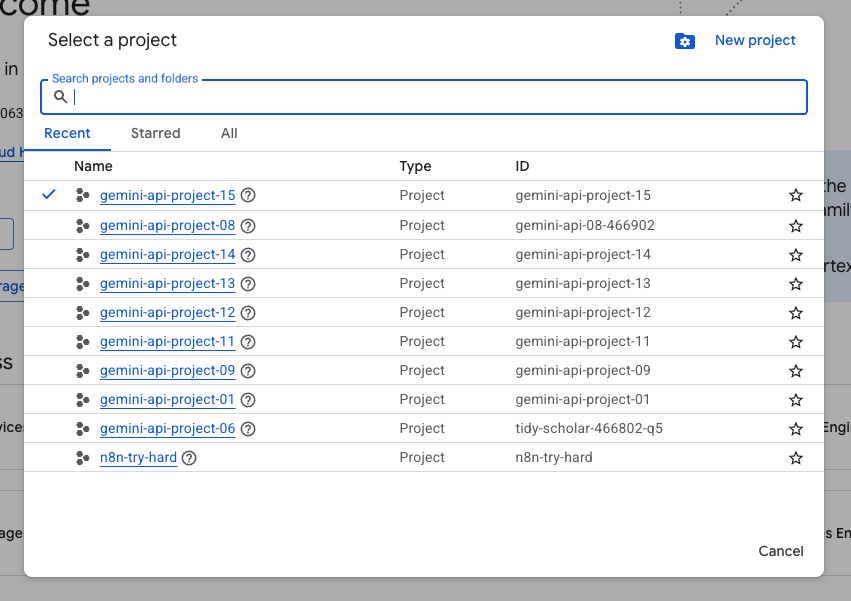
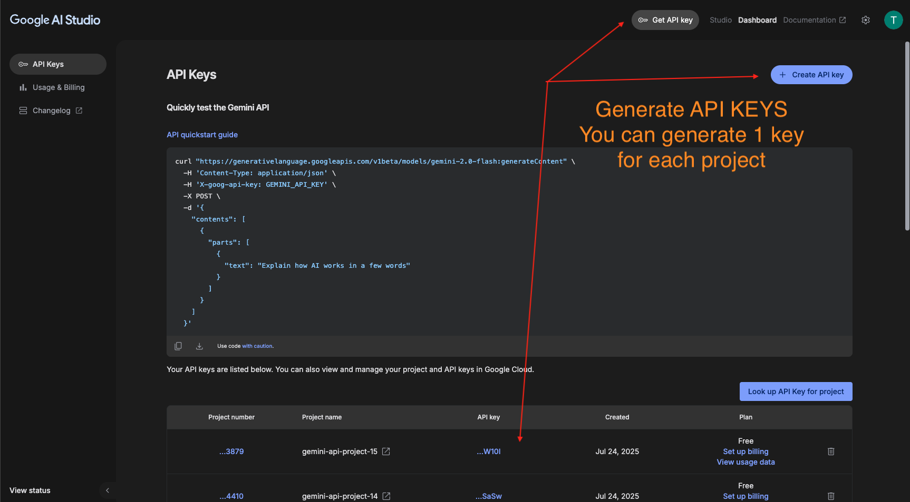
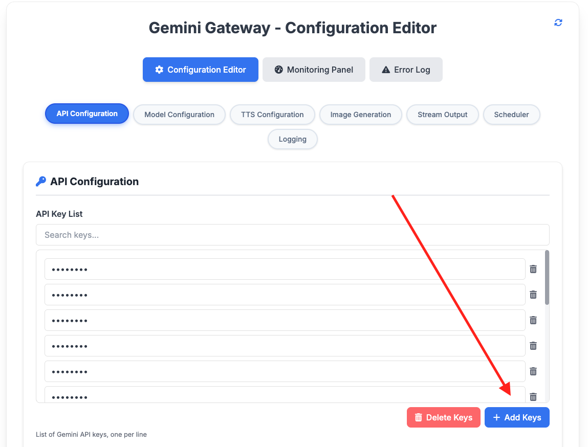
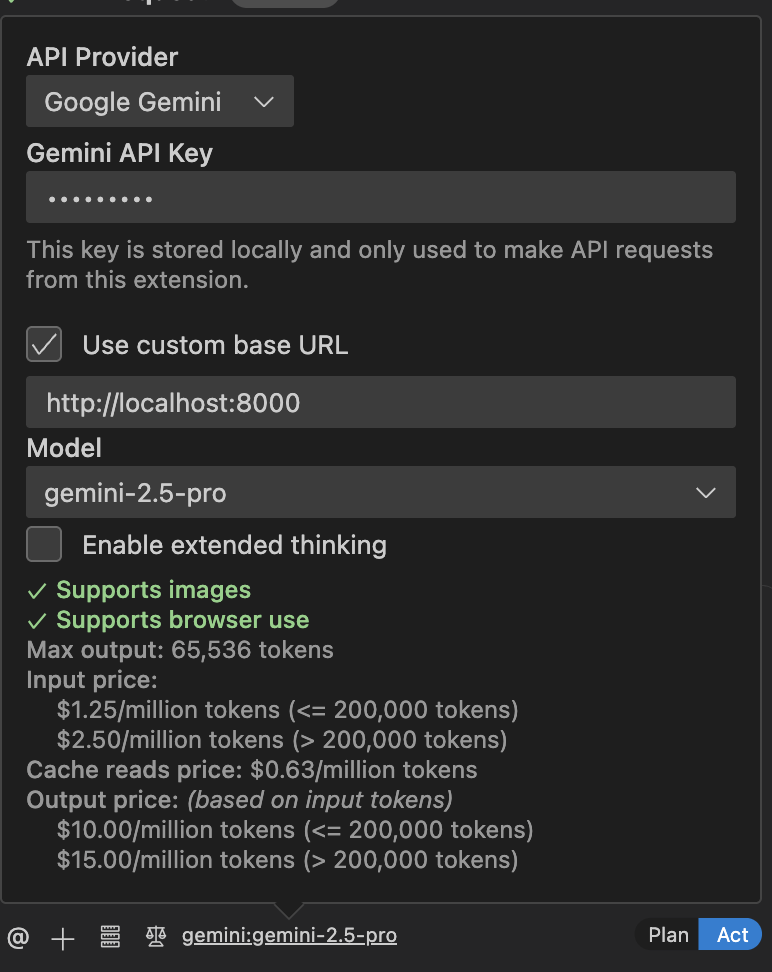

# Local Installation Guide for Gemini Gateway

This guide provides step-by-step instructions to install and run Gemini Gateway on your local machine.

## Step 1: Clone the Repository

Clone the Gemini Gateway repository from GitHub to your local machine.

```bash
git clone https://github.com/thuanha-groove/gemini-gateway
```

## Step 2: Configure Environment Variables

Navigate to the cloned repository's directory and copy the example environment file. You can edit the `.env` file later to customize your configuration.

```bash
cd gemini-gateway
cp .env.example .env
```

## Step 3: Run with Docker

Use Docker Compose to build and run the application. If you have an older version of Docker, you might need to use `docker-compose` instead of `docker compose`.

**Note:** If the default port `8000` is already in use on your local machine, you can change the exported host port in the `docker-compose.yml` file. For example, to use port `8001`, change `8000:8000` to `8001:8000`.

```bash
docker compose up -d
```

or for older versions:

```bash
docker-compose up -d
```

## Step 4: Verify Server Status

Wait for the Docker containers to start completely. You can then check if the server is running by opening the following URL in your browser:

[http://localhost:8000](http://localhost:8000)

You can log in with the following credentials:
**API Key:** `sk-123456`

## Step 5: Set Up Google Cloud Projects

For effective API key rotation, it is recommended to create multiple Google Cloud projects.

1.  Go to the [Google Cloud Console](https://developers.google.com/workspace/guides/create-project) to create your projects.
2.  Create up to 10 projects.
   



**Note:** Do not create any API credentials from the Google Cloud Console. You only need to create the projects.

## Step 6: Generate and Add Gemini API Keys

1. Go to [Google AI Studio](https://aistudio.google.com/) to generate Gemini API keys. Note to use the same Google account as above.
2.  Generate a key for each project you created.
3.  Copy each key and add it to the Gemini Gateway's key list in the configuration.
4.  Remember to save the configuration after adding the keys.



## Step 7: Add API Keys to Gemini Gateway
[http://localhost:8000](http://localhost:8000)
1.  Navigate to the configuration page in the Gemini Gateway UI.
2.  Add your generated API keys to the `gemini_keys` list.
3.  Save the changes



## Usage

### Use with Cline

To use Gemini Gateway with Cline, you need to configure the API key and endpoint in your Cline settings.

1.  **API Key:** Use the API key you configured in the `.env` file (`sk-123456` by default).
2.  **Endpoint:** The API endpoint is `http://localhost:8000`.

You can then use Cline to interact with the Gemini Gateway.


### Use with Chatbox or any AI Chat Tool
[Chatbox](https://chatboxai.app/en)

To use Gemini Gateway with any chat tool, you need to configure the API key and endpoint in your tool's settings.

1.  **API Key:** Use the API key you configured in the `.env` file (`sk-123456` by default).
2.  **Endpoint:** The API endpoint is `http://localhost:8000`.
